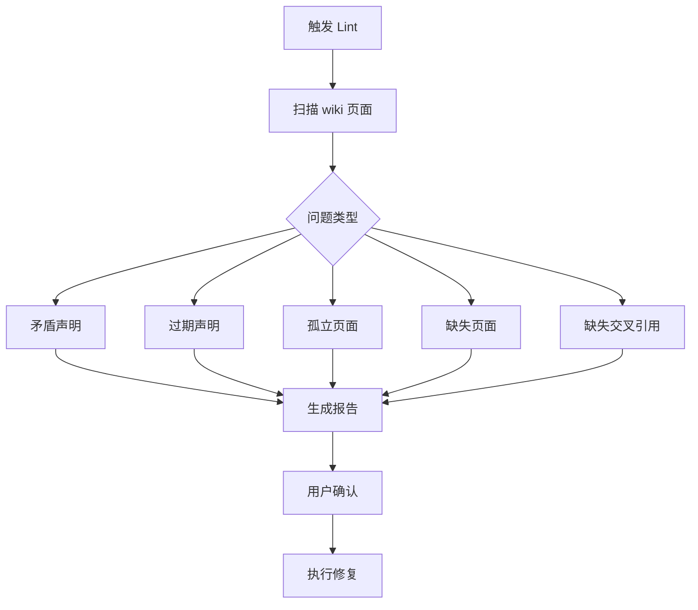

## Wiki Lint

## 定义

Wiki Lint 是 LLM Wiki 模式中的定期健康检查操作，指 LLM 对 wiki 进行全面检查，识别并标记结构问题、内容矛盾和维护需求的过程。Lint 操作确保 wiki 随规模增长保持健康和一致性。

## 为什么重要

随着 wiki 规模增长，可能出现页面孤立、声明过期、页面间矛盾、缺失交叉引用等问题。Wiki Lint 通过定期检查解决这些问题，防止知识库退化为杂乱的文件集合 [[知识库编译]]。

LLM 擅长识别需要维护的地方：标记矛盾、发现孤立页面、建议新来源。这使得 wiki 在增长时保持健康，而无需人类手动追踪所有依赖关系。

## 工作原理

Lint 检查的典型流程：

1. **触发**：用户请求 LLM 对 wiki 进行健康检查，或定期自动触发
2. **扫描**：LLM 扫描 wiki 页面，检查以下问题
3. **报告**：LLM 生成问题列表，按优先级排序
4. **修复**：用户确认后，LLM 执行修复操作

Lint 检查的问题类型：

| 问题类型 | 描述 | 修复方式 |
|----------|------|----------|
| 矛盾声明 | 不同页面之间的信息冲突 | 标记矛盾，提示用户裁决 |
| 过期声明 | 被新来源推翻的旧声明 | 更新或标记为过时 |
| 孤立页面 | 无入站链接的页面 | 添加到索引或建立链接 |
| 缺失页面 | 被提及但无独立页面的概念 | 创建新页面存根 |
| 缺失交叉引用 | 应链接但未链接的相关页面 | 添加双向链接 |
| 数据缺口 | 可通过网络搜索填补的信息 | 建议新来源或搜索查询 |

## 关键属性 / 权衡

- **检查频率**：可定期（如每周）或在重大摄入后触发
- **自动化程度**：LLM 识别问题，但某些修复（如解决矛盾）需人类裁决
- **可扩展性**：大规模 wiki 可能需要专用工具（如 qmd）辅助搜索
- **预防性维护**：Lint 不仅修复问题，还建议新调查方向和新来源
- **与摄入的关系**：摄入时即时更新 + 定期 Lint 深度检查 = 健康 wiki

## 相关概念

- **并行操作**：[[增量式摄入]] — 摄入时即时更新，Lint 定期深度检查
- **上游概念**：[[知识库编译]] — Lint 是维护编译后知识库健康的机制
- **工具支持**：[[LLM-辅助知识管理]] — Lint 脚本是 wiki-tools 技能之一

## 来源依据

- [[summary-llm-wiki-2026-04-06]] — 描述了三种操作中的 Lint 流程
- raw/llm-wiki-2026-04-06.md — 详细说明了 Lint 检查的问题类型和价值

关键引用：
> "Periodically, ask the LLM to health-check the wiki. Look for: contradictions between pages, stale claims that newer sources have superseded, orphan pages with no inbound links."

> "The LLM is good at suggesting new questions to investigate and new sources to look for. This keeps the wiki healthy as it grows."

## 待解决问题

- Lint 检查的最佳频率：是按时间（如每周）还是按事件（如每摄入 10 个来源）触发 [未验证]
- 如何量化 wiki 健康度：是否需要定义健康指标（如孤立页面比例、交叉引用密度）[未验证]
- 大规模 wiki 的 Lint 效率：是否需要增量 Lint（仅检查变更部分）而非全量扫描 [未验证]
