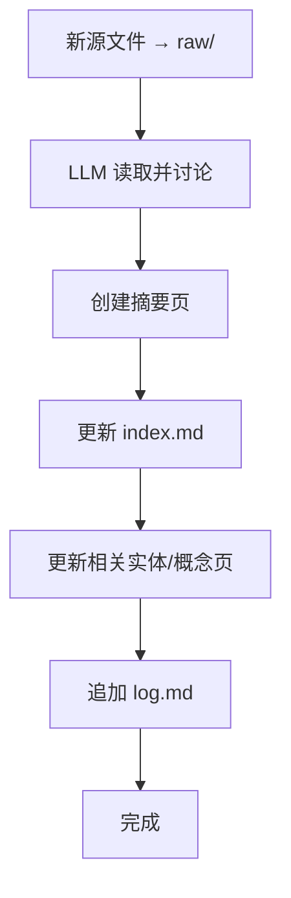

## 增量式摄入

## 定义

增量式摄入是 LLM Wiki 模式中的一种核心操作，指当新源文件添加到 raw 集合时，LLM 读取该源、提取关键信息，并将其整合到现有 wiki 中的过程。单个来源可能触及 10-15 个 wiki 页面，包括更新实体页、修订主题摘要、标记矛盾之处。

## 为什么重要

增量式摄入确保知识库随新来源的添加而持续增长和更新，而非静态存档。每次摄入新来源时，LLM 不仅创建摘要页，还更新整个 wiki 中的相关页面，维护交叉引用的一致性 [[知识库编译]]。这使得 wiki 成为"持久且不断累积的产物"，知识随时间推移而复合增长。

与传统 RAG 的"上传后检索"不同，增量式摄入了取主动整合：LLM 在摄入时就建立连接，而非查询时才临时检索片段。

## 工作原理

典型的摄入流程：

1. **添加源文件**：用户将新源文件（文章、论文、数据文件）放入 raw 集合
2. **LLM 读取**：LLM 读取源文件，与用户讨论关键要点
3. **创建摘要页**：LLM 在 wiki/summaries/ 中创建摘要页
4. **更新索引**：LLM 更新 index.md，添加新条目
5. **更新相关页面**：LLM 更新整个 wiki 中的实体页、概念页、主题页
6. **记录日志**：LLM 在 log.md 中追加摄入记录

用户参与模式：
- **监督模式**：逐个摄入来源，用户阅读摘要、检查更新、指导 LLM 强调重点
- **批量模式**：一次性摄入多个来源，较少监督

## 关键属性 / 权衡

- **影响范围**：单个来源可能更新 10-15 个 wiki 页面
- **人类参与度**：可选择高监督（逐个摄入）或低监督（批量摄入）
- **维护负担**：LLM 承担更新交叉引用、保持一致性的工作，人类专注于策划来源
- **可扩展性**：在中等规模下工作良好，大规模可能需要搜索工具辅助
- **不可变性**：raw 源文件永不修改，确保真相来源的完整性

## 相关概念

- **上游概念**：[[知识库编译]] — 增量式摄入是编译的具体实现方式
- **并行操作**：[[Wiki-Lint]] — 定期健康检查，与摄入操作互补
- **架构组件**：[[LLM-辅助知识管理]] — 摄入流程依赖 LLM 的维护和整合能力

## 来源依据

- [[summary-llm-wiki-2026-04-06]] — 描述了三种操作中的 Ingest 流程
- raw/llm-wiki-2026-04-06.md — 详细说明了摄入的具体步骤和人类参与模式

关键引用：
> "When you add a new source, the LLM doesn't just index it for later retrieval. It reads it, extracts the key information, and integrates it into the existing wiki."

> "A single source might touch 10-15 wiki pages."

## 待解决问题

- 批量摄入时如何确保质量，是否需要事后 Lint 检查
- 如何处理源文件之间的矛盾：是在摄入时立即标记，还是留待 Lint 阶段统一处理 [未验证]
