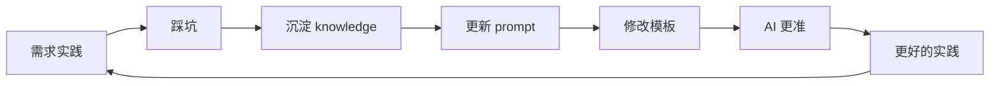

# 知识飞轮

## 定义

需求实践 → 踩坑 → 沉淀 knowledge / 更新 prompt / 修改模板 → AI 更准 → 更好的实践。不仅是领域知识，prompt 和模板自身也在飞轮中。这是一个正向循环，持续提升 AI 编码质量。

## 为什么重要

知识底座才是真正的护城河。团队之间的差距不在于用什么工具，而在于积累了多少高质量的、结构化的领域知识。

最关键的知识——领域 Know-How、架构决策的前因后果、踩坑后的最佳实践——恰恰是纯 Spec 框架最难覆盖的。这也是为什么框架里有 `knowledge/` 目录，而不是只有 `rules/`。

一个没有 knowledge/ 的 Spec 框架，就像让一个刚入职的应届生对着编码规范写代码——规范他都能遵守，但业务逻辑全靠猜。

## 工作原理

### 飞轮循环

### 知识覆盖缺口

| 知识类型 | Spec 能覆盖 | 实际重要性 |
| --- | --- | --- |
| 编码规范 | ★★★★ | ★★★ |
| 存量代码 | ★★★ | ★★★★ |
| 领域知识 | ★ | ★★★★★ |
| 架构决策 | ★★ | ★★★★★ |
| 团队隐性经验 | ☆ | ★★★★ |

### 知识沉淀流程

1. 每个 task 完成后立即检查是否踩坑/发现隐含规则/学到新东西
2. 有则立即写入 log.md
3. /archive 时逐条展示 log.md 知识发现
4. 用户确认后沉淀到 knowledge/

## 关键属性 / 权衡

- **正向循环**：知识沉淀 → AI 更准 → 更好的实践 → 更多知识沉淀
- **不可复制**：高质量的、结构化的领域知识是真正的护城河
- **长期收益**：知识飞轮的效果需要长期实践验证
- **成本**：需要持续投入知识沉淀工作
- **风险**：知识质量需要保障，低质量知识会降低飞轮效果

## 相关概念

- 建立于：[[Spec-Coding]] — 知识飞轮是 Spec Coding 的知识沉淀机制
- 用于：[[AI-编码实践]] — AI 编码方法论的核心实践
- 关联：[[Reverse-Sync]] — Reverse Sync 是知识飞轮的输入
- 关联：[[增量式摄入]] — 知识飞轮是增量式摄入的长期效果

## 来源依据

- [[summary-2026-ai-bian-ma-jian-jin-shi-spec-shi-zhan-zhi-nan]] — 主要来源，逸驹（2026）
- raw/2026 年 AI 编码的"渐进式 Spec"实战指南.md — 第 2.4 节、第 5.3 节

## 待解决问题

- 知识质量保障：如何确保沉淀的知识是高质量的？[未验证]
- 知识索引优化：如何优化 knowledge/index.md 的触发关键词？[未验证]
- 知识复用：如何让沉淀的知识在不同项目间复用？[未验证]