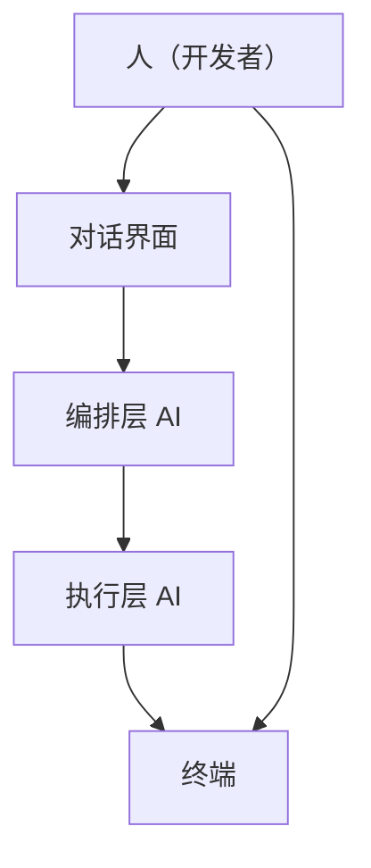

# 编排层与执行层

## 定义

两层 AI 架构：编排层 AI（强模型）负责理解需求、生成 Spec、审查结果；执行层 AI（编码工具）负责读写代码、执行命令、运行测试。分层后各取所长，成本和质量都更优。

## 为什么重要

单一工具很难同时满足"强模型做决策"和"安全模型写代码"两个需求。把两者混在一起，要么模型太贵（全程用顶级模型写代码），要么质量不够（全程用便宜模型做决策）。

分层架构解决了这个问题：
- 编排层用强模型做决策，确保理解准确、设计合理
- 执行层用编码优化模型写代码，确保效率高、成本低

## 工作原理

### 架构图

### 层次职责

| 层 | 擅长 | 模型选择 |
| --- | --- | --- |
| 编排层 | 理解模糊需求、生成结构化 spec、跨仓库业务分析、审查决策 | 强模型（Claude Opus、Gemini Pro 等） |
| 执行层 | 读写代码、执行 shell 命令、快速迭代修改 | 编码优化模型（Sonnet、Kimi 等） |

### 关注点分离

- 编排层：决策、设计、审查
- 执行层：实施、验证、迭代

## 关键属性 / 权衡

- **成本优化**：强模型只做决策，便宜模型做实施
- **质量保障**：决策层用强模型，确保理解准确
- **效率提升**：执行层用编码优化模型，确保快速迭代
- **透明度要求**：模型型号+版本可见、完整 context 可查、原始输出不被篡改、token 用量透明
- **风险**：两层之间的协作需要明确的接口和流程

## 相关概念

- 建立于：[[Agent-Loop]] — 编排层和执行层是 Agent 工作流的分层实现
- 用于：[[AI-编码实践]] — AI 编码架构的核心设计
- 关联：[[上下文工程]] — 编排层负责上下文管理
- 关联：[[Spec-Coding]] — 编排层负责生成 Spec

## 来源依据

- [[summary-2026-ai-bian-ma-jian-jin-shi-spec-shi-zhan-zhi-nan]] — 主要来源，逸驹（2026）
- raw/2026 年 AI 编码的"渐进式 Spec"实战指南.md — 第 3.1 节

## 待解决问题

- 层间接口：编排层和执行层之间的接口如何标准化？[未验证]
- 自动切换：能否让 AI 自动判断何时需要切换层？[未验证]
- 工具选型：不同场景下如何选择编排层和执行层工具？[未验证]